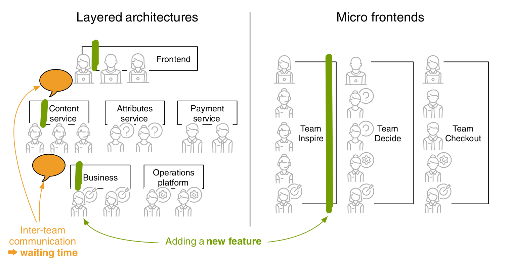

## What are Microfrontends

- Teams should be made according to use cases / single missions rather than based on technologies and skill in order to implement Microfrontends
- Team will be autonomous, free to use their on tools

### Frontend Integration

#### Routing and Page Transitions
- integration on page level. 
- can be acheived by html links for server side renders.
- *** You can implement this by having a shared application shell or
using a meta-framework like single-spa ***

#### Composition
- getting fragments together in right slots
- normally a placeholder is placed by the page and there is a separate composition service that works actual assembly
- can be divided into
  1. Server side composition for example with SSI, ESI, Tailor or Podium
  2. Client side composition for example with iframes, Ajax, or Web Components

#### Communication
- for interactive apps, u need communication between components such as when one is updated other should have to update as well

### Shared Topics
- To work autonomously following things should be kept in mind
  1. Web Performance
  2. Common Design System
  3. Sharing Knowledge

* If a new feature is asked to developed, most likely it will originate from marketing team, moved to fronted team, scheduled in next sprint and will be complete when the last team in the hierarchy finishes the task. In microfronteds there is a new team that contains people from all those service teams to work on a single goal

* The goal is to share as little as possible to enable fast feature development. as communication is expensive
* micro frontend projects have a strong tendency to accept redundancy in
favor of more autonomy and higher iteration speeds

### Drawback of Microfrontends
1. Redundancy
   1. there can be duplicate code (JS/CSS) in this architecture
   2. a team performing bug fixes and improving performance may not benefit other teams as long as they dont share the fixes and techniques directly
2. Consistency
   1. teams may depend on other teams for data. ( may be a team daily replicates a data from the data owner team => which is costly and time consuming and changes in real data may not reflect quickly in replicated one)
3. Heterogenity
   1. different technologies or same, see the trade off according to your project and company
   
* The Two-Pizza Team Rule suggested by Amazon CEO Jeff Bezos is an indicator for a good team size. It says that a team is too big when two large pizzas can’t feed it

* To make good vertical cuts (vertical teams or cross functional teams) it’s important to know your company’s domain well. Changing responsibilities afterward works but creates friction