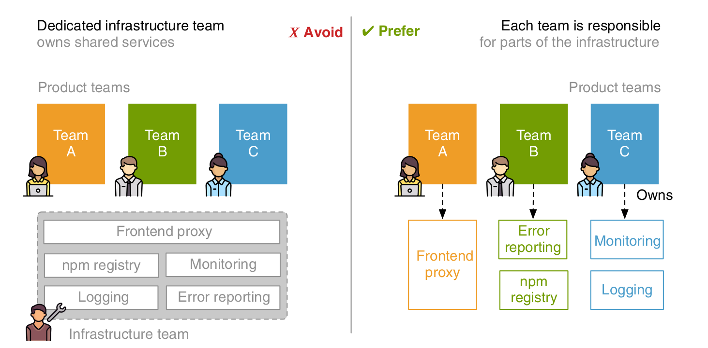

# Composition with Ajax and server-side routing

## Composition with Ajax
- due to iframes SEO were affected
- now team inspire will server a fragment of html along with an absolute link of its new `fragment.css` as it will be inserted into the dom by team decide
- team decide will make an ajax call to this to get this fragment

### Namespacing styles and scripts
- this approach can lead to mixing of styles
- isolate css with naming conventions like .decide.recos, .inspire.header
- isolate javascript by `IIFE` or 
```
    <script data-inspire-state type="application/json">
    {"name":"Porsche"}
    </script>

    ...

    const stateContainer = fragment.querySelector("[data-inspire-state]");
    const MY_STATE = JSON.parse(stateContainer.innerHTML)
```

- Namespacing helps with more than just avoiding conflicts. Another valuable factor in
day-to-day work is that they also indicate ownership. When an enormous cookie value
leads to an error, you just have to look at the cookie name to know which team can
fix that

### Declarative loading with h include library
- <h-include src="/url/to/fragment.html"></h-include>

### Benefits of ajax 
- Natural Document flow => no iframe and the height is irrelevant embedding team
- easy SEO and better Accessibility 
- progressive enhancement => javascript failed callback can be provided ( like show recommendation link for people who failed to execute this javascript)

### Drawbacks
- asynchronous
- *** missing isolation ***
- server request required ( consider bad network condition )
- *** no lifecycle for scripts ***

## Server Side routing with Nginx
- create a frontend proxy where all requests will land and routed to respective servers

### Namespacing resources
- teams does not care about domains due to proxy. ( new url => /product/:sku )
```
old: http://localhost:3002/fragment/recommendations/<sku>
new: /inspire/fragment/recommendations/<sku>
```
### Route configuration methods
1. TEAM ROUTES ONLY
   
The configuration looks like this:
/decide/-> Team Decide
/inspire/ -> Team Inspire
/checkout/ -> Team Checkout
URLs that show up in the browser address bar, search results, or printed marketing material, this may be an issue. You are exposing your internal team structure through the URLs. You also introduce words (like decide, inspire) which a search engine bot would read and add to their index. Choosing shorter one- or two-letter-prefixes can moderate this effect. This way your URLs might look like this:
/d/product/porsche
/i/recommendations
/c/payment 

1. DYNAMIC ROUTES CONFIGURATION
   
/product/* -> Team Decide
/wishlist -> Team Decide
/recommendations -> Team Inspire
/summer-trends -> Team Inspire
/cart -> Team Checkout
/payment -> Team Checkout
/confirmation -> Team Checkout

- This list in front end proxy will become complex with time

### Infrastructure ownership

