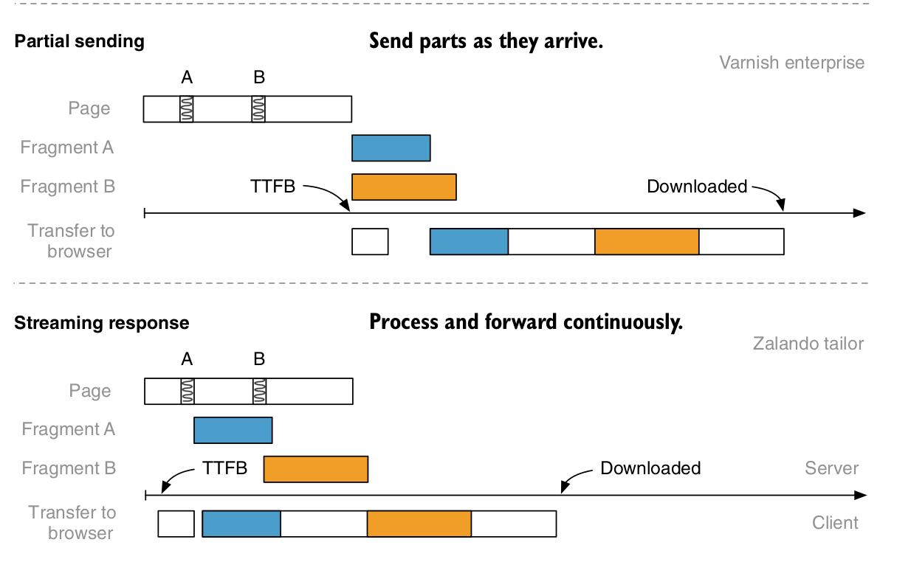

# Server side composition

## Composition via Nginx and Server-Side Includes (SSI)
- ajax composition solved alot of problems including decoupling and SEO but the problem is with users with high latency. The experience is not good for them. so developers decided to move to SSI
  
Team Decide needs to make two changes:
1. Activate Nginx’s SSI support in the web server’s configuration.
2. Add an SSI directive to their product template. The SSI’s URL must point to Team Inspire’s existing recommendation endpoint

### HOW SSI WORKS
- Let’s look at an overview of how SSI processing works. We have to turn `ssi on` and then  we must add the SSI include directive to the product page’s markup. 
`<!--#include virtual="/url/to/include" -->`
The web server replaces this directive with the contents of the referenced URL before
it passes the markup to the client.


- page will now laod faster
- But what happens when one of the applications is slow or has a technical problem

### The flaky fragment
- mean while Team Inspire were building a prototype of a new feature called “Near You.” It informs the tractor fan when a real-world version of one of their favorite models is working in a field nearby area. This fragment is slow since it does alot of work behind the scenes ( GPS, geolocation apis etc)
- It will slow down the markup generation for the complete product page
- The composition service has to wait for all the required fragments if one of fragments is slow

### Timeouts and fallbacks
- With the property `proxy_read_timeout` , you can configure a timeout after which Nginx categorizes an upstream as non-functional
- Nginx has a built-in mechanism to deal with failed includes. The SSI command has a parameter called `stub`

- Thinking about fallbacks and timeouts is crucial when you implement server-side composition
  
## Markup assembly performance in depth
### Parallel loading

- Nginx SSI fetches all urls in parallel


### Deffered Loading
- Additional fragments that are farther down the page or are optional can be lazy-loaded (ajax calls)
- If you want the fragment in the initial markup, you specify it as an SSI directive
- For performance, you can stream the initial data as soon as nginx receives it



## Other Solutions

### Edge side includes (ESI)
- Edge-Side Includes, or ESI, is a specification that defines a unified way of markup assembly which proxy servers like `Varnish` supports
- `<esi:include src="https://tractor.example/fragment" />`
- support fallbacks and timeouts

### Zolando Tailor

- Tailor is a Node.js library that parses the page’s HTML for special fragment tags, fetches the referenced content, and puts it into the page’s markup
```
<fragment
src="http://localhost:3002/recos"
timeout="500"
fallback-src="http://localhost:3002/recos/fallback"
/>
```
- supports timeouts and fallbacks
  
### Podium
- Inspired by `Tailor` and in it, fragments are called podlets, and pages are layouts.
- every `podlet` has meta data associated with it called `podlet manifest`
- 
- Team Decide uses @podium/layout and registers Team Inspire’s manifest endpoint. Team Inspire implements @podium/podlet to provide the manifest.
- gives options for fallback and timeouts