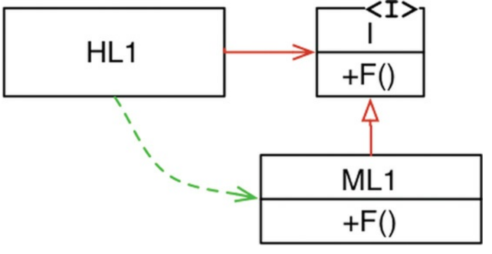

# Clean Architecture
## By Robert Cecil Martin

### Chapter 5: OOP
#### Polymorphism

Polymorphism is an application of pointers to functions. So OOP does not provide something new in this regard as the concept exists before it but for sure it provides safety and makes polymorphism trivial

* Dynamic Polymorphism
  * Run-Time polymorphism
  * Dynamic binding
  * Run-Time binding
  * Late binding
  * Method overriding
* Static Polymorphism
  * Compile-Time polymorphism
  * Static binding
  * Compile-Time binding
  * Early binding
  * Method overloading

##### Dependency Inversion

Without polymorphism a typical program will have a calling tree where High level functions calls mid level functions that ultimately call lower level functions creating a tree. So source code dependencies ( main function has a dependency of Hight level component/class ) follows the flow of control. And programer had to use `import` in java and `include` in C to call that function from `main`. So flow of control was dictated by the behaviour of the system and source code dependencies were dictated by flow of control

In an example where `HL1` a module, calls function `F()` of `ML1` another module through an interface is source code contrivance. At runtime that interface will not exist. and `HL1` simply calls `F()` on `ML1`.

Note that the source code dependency (the inheritance relationship) between
`ML1` and the interface `I` points in the opposite direction compared to the flow of control. This is called dependency Inversion.

software architect can
point the source code dependency in either direction

For a software architect, OO is the ability, through the use of polymorphism, to gain absolute control over every source code dependency in the system

### Chapter 18: Boundry Anatomy

#### Two Important Concepts
* Flow of Control
* Source Code Dependencies

When a high-level client needs to invoke a lower-level service, dynamic polymorphism is used to invert the dependency against the flow of control. The runtime dependency opposes the compile-time dependency

