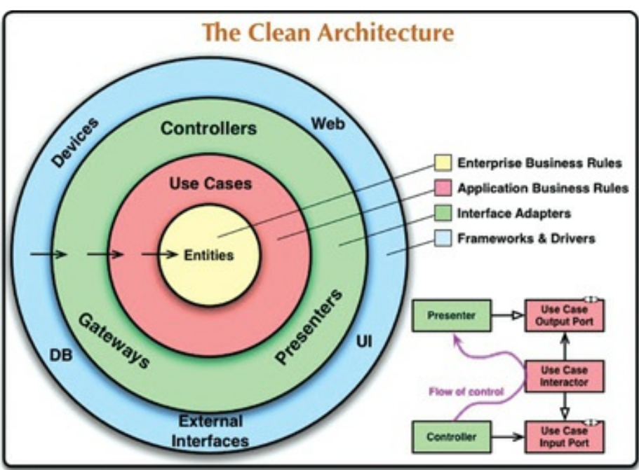

### Chapter 22: Clean Architecture

All source code dependencies should point invards towards high level policies

For the data to cross the boundry, The important thing is that isolated, simple data structures are passed across the boundaries. We don’t want to cheat and pass Entity objects or database rows. We don’t
want the data structures to have any kind of dependency that violates the Dependency Rule.