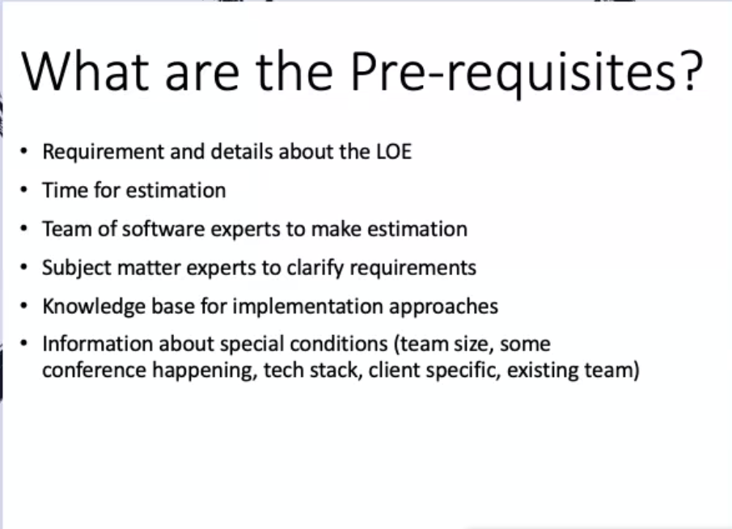
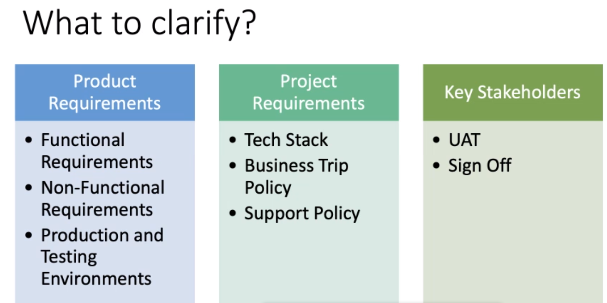

# Estimation 10perls way

## Goals
Benefitls of LOE
LOE Process
Common mistakes

* what you have to make in a year ( a project ) you have to make it in your mind in 2 days

## Initial Process

## Classification of Project Estimation
* (LPA) lean product acceleration ( discovery workshop ). 
* Level 1 => High level => Months
* Level 2 => weeks
* Level 3 => task level => hours
* a project can be estimated for either of these level
  
## Prerequisites 

* SME ( subject matter experts ) to clarify requirements

## Who will get you an LOE
* a technical architect and a Business representative

## what to clarify

* performance, security, usability etc => non functional
* know your end users ( who are they, age, education, profession etc)
  
## What to estimate

* for WBS u you should break the project in such a way that you can make the other one understand of low level task eaisly. so that you can give task an estimation that ok this task can be done in a day
* talk to people to know about problems that are common or occured already
* only add buffer where you think there is some unkown. try not to add buffer, since buffer will be added later on and you may not be working on that project. you are just giving an LOE
  
## Questions for better Understanding

## Mistakes

* comparitively breadth should be covered. depths can later be managed. if you miss an aread in breadth, the time for QA, testing etc will be missed and a big space will be created in your estimate
* especially dont assume alot (COGNITIVE BIASES). Explore every possible way/method

## Expected Results
